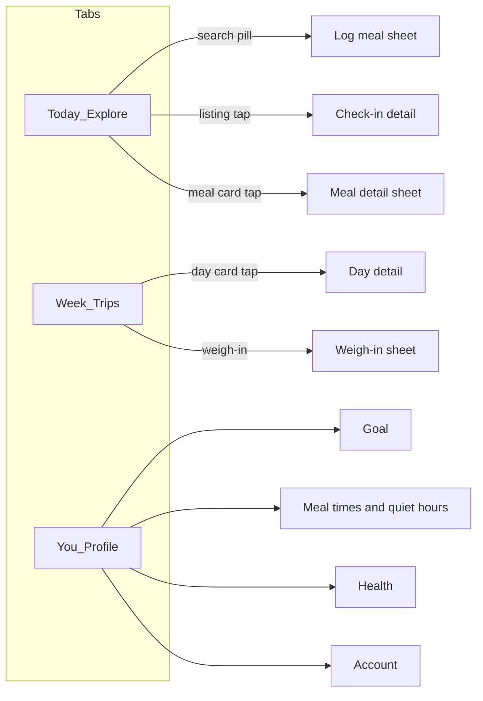

# Airbnb-style IA redesign

Passes 0–6 already made the app *look* considered. It still *opens* like a calorie dashboard: Today is a stack of widgets (kcal hero, note, protein, button), Week is a report, Settings is a Form. Airbnb’s feel comes from **jobs per screen**, not more springs.

Steal the journey. Keep terracotta, Fraunces, paper, and “manager not punisher.” Do not copy Explore/Wishlists/Trips or Cereal/white.

## What Airbnb actually contributes

- **One job per tab.** Explore browses, Trips is your journey, Profile is you.
- **The first control is a search pill**, not a stat.
- **Cards are portals.** Tap a listing → you enter a world (you already have this for check-in → [`PrescriptionView.swift`](ios/SetPoint/Features/CheckIn/PrescriptionView.swift)).
- **Price + Reserve stay pinned.** The number never competes with the story; it lives in a sticky bar.
- **Profile is destinations**, not one giant form.
- **Progressive disclosure.** One question at a time (onboarding already does this after Pass 6).

Do not add a Wishlists tab, maps, category chips, or photo-marketplace chrome. SetPoint is a manager, not a catalog.

## New information architecture

Three tabs, same count, different jobs:



- **Today** = Explore. The day as a place you’re in. Meals are listings. The check-in is the featured listing. Logging is search.
- **Week** = Trips. Destination (weight goal) + this week’s stays (days as cards).
- **You** = Profile. Identity header + rows that push to their own screens.

[`MainTabView.swift`](ios/SetPoint/App/MainTabView.swift) today: `Today / Week / Settings` with large nav titles. After: `Today / Week / You`, custom headers, no `.large` titles competing with the content.

## First 10 seconds (Today)

Current [`HomeScreen.swift`](ios/SetPoint/Features/Home/HomeScreen.swift) stacks `LedgerHero` → `ManagerNote` → check-in → protein → button.

New open, top to bottom:

1. **Search pill** — “What did you eat?” (photo + text implied). Opens the existing log-meal sheet as a large detent, like Airbnb’s search modal. This is always the way in; it is not a tab.
2. **Manager line as the page voice** — Fraunces, unboxed. `managerNote` is the greeting, not a widget.
3. **Featured listing** — active check-in, if any, as the large card (existing morph stays).
4. **Meal feed** — today’s meals as listing cards. Title from `rawInput`/summary, time, kcal as the “price.” No stored photos today (`photoUrl` is unused), so v1 uses a typographic cover (meal name on `Palette.accentTint`), not fake food photography.
5. **Empty state** — if no meals and no check-in: inviting, not a blank dashboard. “Nothing logged yet — tell me what you ate.”
6. **Sticky reserve bar** (above the tab bar) — remaining/over kcal + primary “Log a meal” when `framing.primaryCta == log_meal`, otherwise a quiet secondary. The ledger **moves here** from the 58pt hero so the number is always visible without owning the screen. Protein can live as a small chip in this bar, not its own card.

This deliberately moves §5.2’s “ledger as hero” into Airbnb’s “price bar” role. Math, framing, and accent rules stay.

## Week as Trips

[`SettlementView.swift`](ios/SetPoint/Features/Settlement/SettlementView.swift) is already the honest-truth tab. Restyle the job, don’t add celebration.

- **Destination block** (weight goal) at top: where you’re going, kg remaining, pace pill, ETA. Weigh-in is “check in to your stay” when `needsWeighIn`.
- **Days as trip cards**, not a table of `DayRow`s. Each card: date, kind color (existing `Palette.day*`), kcal vs target, one manager line. Tap → day detail (meals that day).
- Week summary stays Fraunces, as the host’s note on the trip.

## You as Profile

Replace the Settings `Form` in [`SettingsView.swift`](ios/SetPoint/Features/Settings/SettingsView.swift) with:

- **Identity header**: goal in voice type, mode (Smart/Basic), current weight if any. Not a name plate we don’t have.
- **Destination rows**: Goal, Check-in rhythm (meal times + quiet hours), Health, Account.
- Each row pushes a focused screen. Save stays per-screen. Delete account stays a confirmation, unchanged.

## Flows that stay, with a new wrapper

- **Onboarding** — Pass 6 journey is already the right shape. Leave the beats; only match the new search-pill / floating-CTA chrome if Today’s language drifts.
- **Check-in morph** — keep. It is the listing → detail transition.
- **Log meal parse reveal** — keep (Pass 3). The sheet should open full/large from the pill.
- **Sign-in** — same copy, more air, sticky Apple button at the bottom (already close).

## Backend (small, required for the feed)

[`backend/src/dashboard/home.ts`](backend/src/dashboard/home.ts) already loads `todayMeals` and throws the rows away after summing. Extend `HomeView` with:

```ts
meals: { id, loggedAt, kcal, proteinG, source, summary }[]
```

`summary` = `rawInput` (already stored). Mirror on [`HomeResponse`](ios/SetPoint/Networking/DTOs.swift). Add a dated meals fetch for Week day-detail (`GET /api/meals?date=` or include per-day meals on settlement — prefer a small meals list endpoint so Week stays light).

No new product math. No photo storage in this redesign.

## What we will not change

- Confidence engine, prescription solver, safety/SCOFF, auto-maintenance.
- Palette, Fraunces/SF Rounded split, `Motion`, Reduce Motion, haptics rules.
- Tab count stays 3. No fourth “Log” tab (Airbnb doesn’t make Book a tab).

## Sequencing (same pass rhythm as 0–6)

Each pass: simulator review on `iPhone 16 Pro` + its own commit. Reuse `-uiStub` states; add `home-empty` and `you`.

1. **Pass 7 — Today shell.** Search pill, unboxed manager line, sticky reserve bar, hide large titles. Still no meal cards (use `mealsToday` empty/copy). Proves the open.
2. **Pass 8 — Meal listings.** Home API meals + cards + meal detail sheet (macros, undo if just logged).
3. **Pass 9 — Week as trips.** Day cards, destination-as-trip, day detail.
4. **Pass 10 — You.** Profile shell + setting destinations. Retire the monolithic Form.
5. **Pass 11 — Cross-flow.** Sign-in, empty states, onboarding chrome consistency, stub screenshots.

Pass 7 is the one that makes the app *feel* different. 8–10 fill the IA. 11 is the “one object” pass, like Pass 5 was for motion.
