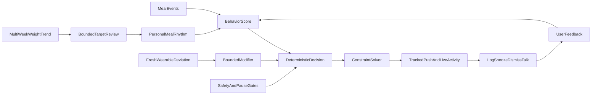

# Make SetPoint Live Up to Its Name

## Product contract
- Focus the product on people who unintentionally under-eat: bulkers, athletes, busy users, and cautious dieters who want a minimum-fueling guardrail.
- Define “Smart” narrowly: meal behavior determines whether a check-in is eligible; fresh HRV/RHR may adjust confidence but can never independently diagnose under-fueling or trigger an intervention.
- Rewrite product copy and legal language to describe observed behavior and uncertainty, not physiological certainty.
- Establish release gates: no paid SMART mode until it demonstrates incremental value in beta; no public release while a P0 safety or delivery defect remains.

## Target architecture

## Phase 1 — Fix product-integrity and safety blockers
- Replace the hardcoded audit score in [backend/src/jobs/scoreConfidence.ts](backend/src/jobs/scoreConfidence.ts) with a pure, versioned scoring module. Initial decision inputs: slot overdue amount, last confirmed meal, logging reliability, dismiss/defer history, and target coverage. Store every component and the scoring version in Prisma.
- Treat wearable data as a capped modifier only when fresh and statistically usable. Combine HRV and RHR in the under-fueling direction; stale or missing data must produce identical behavior to Basic mode. Add a kill switch and cohort rollout flag.
- Convert onboarding custom restrictions into normalized `DietaryRestriction` rows in [backend/src/onboarding/onboard.ts](backend/src/onboarding/onboard.ts); add tests proving every entered exclusion reaches [backend/src/solver/exclusions.ts](backend/src/solver/exclusions.ts).
- Replace Tier-3’s free-form `ADJUST_PLAN` claim with bounded proposals: later check-in window, temporary target easing, or pause. Require explicit user confirmation, then apply the chosen deterministic change in [backend/src/routes/checkins.ts](backend/src/routes/checkins.ts). Never let model prose claim an unapplied action.
- Correct the Tier-3 goal context, notify users when a conversation starts, and prevent unrelated meal logs from closing Tier-3 conversations.
- Align minimum age and medical eligibility across [ios/SetPoint/Features/Onboarding/OnboardingModel.swift](ios/SetPoint/Features/Onboarding/OnboardingModel.swift), backend validation, privacy policy, and terms. Expand the medical gate beyond “currently supervised” and route uncertain cases to passive tracking.

## Phase 2 — Make interventions reliably real
- Add explicit delivery state to check-ins: `CREATED`, `SENT`, `DELIVERED_UNKNOWN`, `FAILED`, `OPENED`, `ANSWERED`. A failed or absent push token must never increment misses or escalation.
- Implement remote Live Activity start/update/end using stored `live_activity_start` tokens; keep standard Time Sensitive notifications as the reliable fallback.
- Add a database-enforced idempotency key for user + local date + meal slot + episode, and create/check it transactionally to prevent duplicate check-ins.
- Split scoring into paginated batches or a queue so one 60-second function never serially handles every user, AI call, and APNs request.
- Move manager copy generation off the critical decision/delivery path: deliver deterministic safe copy immediately, optionally enrich later.
- Add scheduler heartbeat, missed-run alerting, delivery/error metrics, APNs invalid-token pruning, correct Debug/Release APNs environments, and push-token removal on sign-out.
- Use a production scheduler with an explicit reliability target; retain GitHub Actions only as a monitored fallback, not the sole control plane.

## Phase 3 — Make the “set point” adaptive
- Build a transparent feedback controller from multi-week weight trend and logged intake. Require sufficient weigh-ins and data quality before suggesting a target change.
- Use bounded adjustments—for example, no more than 50–100 kcal/day per weekly review—and ask the user to accept the change. Never auto-adjust from one weigh-in.
- Replace one-sample goal completion in [backend/src/weight/logWeight.ts](backend/src/weight/logWeight.ts) with confirmation from a trend or repeated measurements.
- Show why a target changed, the data window used, and an undo path in Week and Goal settings.
- Keep formulas deterministic and versioned; AI may explain a change but cannot calculate or authorize it.

## Phase 4 — Improve prescriptions and meal evidence
- Add pantry/availability, dislikes, dietary style, prep-time, budget, and repetition controls to the solver constraints. Add “Swap” and “I don’t have this” actions that improve future suggestions.
- Ensure prescription items use clear edible quantities rather than ambiguous multipliers such as “2× White rice.”
- Reconcile AI meal totals with item sums in [backend/src/ai/parseMeal.ts](backend/src/ai/parseMeal.ts), rename model self-confidence to an honest estimate-quality label, and default ambiguous photos to review rather than false certainty.
- Preserve correction and recent-meal shortcuts; add post-log editing for every meal source and use correction rate as a quality metric.
- Render the existing `managerNote` on Home or stop generating it. Keep deterministic fallback text as the default until AI copy proves useful.

## Phase 5 — Repair the complete iOS experience
- Centralize 401 handling in [ios/SetPoint/Networking/APIClient.swift](ios/SetPoint/Networking/APIClient.swift) so onboarding, logging, check-ins, HealthKit, and Tier-3 recover consistently.
- Keep conversation and Week content visible on action failure; use inline retry for Settings, weigh-ins, pattern application, day-meal fetches, photo selection, and HealthKit connection.
- Add an offline meal queue with idempotent sync because missing logs directly corrupt intervention decisions.
- Persist onboarding progress and provide a safe sign-out/continue-later path.
- Consolidate duplicate pause controls, surface weigh-in near the plan card when due, and either remove the legacy `LogMealSheet` path or make it the shared production implementation.
- Rework Week language so it reports user outcomes without self-congratulation or blame; validate copy with safety-sensitive users.
- After correctness: add imperial units, localization infrastructure, Dynamic Type testing, and dark-mode support.

## Phase 6 — Release engineering and compliance
- Add versioned Prisma migrations and `prisma migrate deploy`; stop using `db push` for production.
- Add required CI for backend typecheck/tests, iOS build/tests, schema validation, and release configuration checks.
- Add HTTP contract tests, real-Postgres integration tests, score-job concurrency tests, APNs failure tests, and a small app-to-API happy-path suite.
- Complete Sign in with Apple authorization-code exchange and refresh-token revocation on account deletion. Retry orphaned photo deletion through a cleanup job.
- Add payload limits, future meal-time validation, rate limits, separate admin/cron secrets, and production-only disablement of developer login.
- Update stale README/compliance documentation to match actual behavior and capabilities.

## Phase 7 — Evidence-driven beta rollout
- Run schedule-only behavior scoring first; keep wearable modifier disabled for the control cohort.
- Measure notification send success, opened/answered rate, explicit wrong-time rate, “already ate” rate, meal-correction rate, suggestion swap/rejection rate, escalation rate, opt-out rate, week-2 retention, and target-progress stability.
- Compare wearable and control cohorts. Enable or monetize Smart only if it reduces false positives or improves timely meals without increasing opt-outs.
- Define stop conditions: elevated negative feedback, unsafe copy, allergy miss, delivery-correlated false misses, or materially worse retention immediately disables the affected feature.

## Implementation sequence and acceptance gates
1. Product-integrity patch set: real behavior score, custom exclusions, honest Tier-3 actions, aligned eligibility.
2. Delivery patch set: delivery states, no false misses, idempotency, Live Activity, scheduler monitoring.
3. Engineering foundation: migrations, CI, integration tests, centralized auth recovery.
4. Closed beta with behavior-only scoring and explicit success thresholds.
5. Wearable modifier experiment behind a kill switch.
6. Adaptive target review after enough longitudinal data exists.
7. Prescription personalization, offline reliability, units/localization, then broader launch.

The first release gate passes only when: every restriction is enforced; no undelivered check-in can become a miss; every UI-confirmed action has a persisted effect; scoring inputs are auditable; duplicate intervention tests pass; production scheduling and APNs are monitored; and the end-to-end onboarding → meal → check-in → response → Week flow passes against a real database.